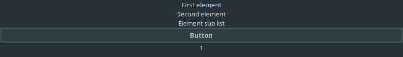

# Reactive Markup

**Reactive-Markup is still in a testing/development phase!**

The main goal of Reactive Markup is to finally allow high-level GUI-programming in Haskell. Gone are the days of manually interfacing with C frameworks!

Here are some (planned) features:
- Declarative
- State/Event handling directly within components
- Easy to create additional elements
- Choose GUI framework depending on the environment

Here is a code example:
```haskell
{-# LANGUAGE DataKinds #-}
{-# LANGUAGE OverloadedLabels #-}
{-# LANGUAGE OverloadedStrings #-}

module Main where

import qualified Data.Text as T
import Data.Colour
import Data.Colour.Names

import ReactiveMarkup.Elements.Settings
import ReactiveMarkup.Elements.Basic
import ReactiveMarkup.Markup
import ReactiveMarkup.Runners.Gtk

main :: IO ()
main = basicGtkSetup "Example" (\_ -> pure ()) myMarkup

myMarkup :: SimpleMarkup '[Set FontColour, Set FontSize, List, Label, Set FontStyle, Set FontWeight, DynamicState, DynamicMarkup, Button] e
myMarkup = expandMarkup $ fontColour white %% fontSizePx 15 %-> list (emptyMarkupBuilder
  +-> label "Some text"
  +-> italicStyle %-> label "Italic text"
  +-> bold %-> list (emptyMarkupBuilder +-> label "Bold text" +-> label "Another bold text")
  +-> greaterFont %-> dynamicState 0 (\i _ -> (Just $ succ i, Nothing))
        (flip dynamicMarkup $ \i -> fontColour (rainbowColour i) %-> list (emptyMarkupBuilder 
          +-> button "Change Colour"
          +-> bold %-> label "Colourful!"
        )))

rainbowColour :: Int -> Colour Double
rainbowColour i = blend factor3 (blend factor2 red yellow) (blend factor2 (blend factor1 red yellow) blue)
  where
    factor1 = sin (0.35 * fromIntegral i)
    factor2 = sin (0.2 * fromIntegral i)
    factor3 = 0.5 + sin (0.25 * fromIntegral i) / 4
```

Here is a screenshot of the above example:


I have already added some **documentation** of the source code! Take a look if you are interested.

## How to build yourself

First and foremost, you need to have **GTK 3** installed!

This projects currently consists of:
- reactive-markup: Main library which defines the markup and some basic components
- reactive-markup-gtk: A gtk implementation of the current components
- examples: Examples on how to use this library
- gtk-hotreload: Hot-Reloading for reactive-markup-gtk

I personally use stack as my build tool and you can build all of these 4 sub-projects with:
```bash
git clone https://github.com/Simre1/reactive-markup.git
cd reactive-markup
stack build
```

Other build systems (cabal/nix) should also work fine, but I have not set up configuration files for those.

This library depends on **gi-gtk**, so keep in mind that compilation takes quite a while.

## What is the Markup datatype?

**Markup** is an extensible datatype which can be extended with an arbitrary amount of elements.
Elements used in this example are
- Label
- List
- Button
- DynamicState
- DynamicMarkup
- Set FontColour
- Set FontSize
- Set FontWeight
- Set FontStyle

**Label**, **List**, **Button** directly correlate with Gtk components that you can see in the screenshot. **Dynamic State** and **Dynamic Markup** allow elements to have internal state and are used to change the font colour on a button press. All the **Set ...** elements are used for styling.

## How does my Markup get rendered?

**Markup** holds the information needed to create a GUI, but not the actual GUI itself. How the **Markup** gets interpreted depends on the used **Runner**. Currently, the only available **Runner** is for GTK, which transforms **Markup** into a GTK widget. However, it is also possible to create **Runner**s for other frameworks.

## Hot Reloading !

I am currently testing hot reloading with the help of ghcid.

You can try it out with:
```bash
ghcid --command="stack ghci" --run="hotReloadMarkupWithoutAsking (\_ -> pure ()) Examples.BasicElements.basicElements"
```

This will hot-reload the example in _examples/src/Main.hs_.

If you are using another build system, make sure that _ghci_ loads _gtk-hotreload/src/HotReload.hs_. You can then hot-reload any **Markup** that is in scope in _ghci_ and that is within the capabilities of the GTK **Runner**!

## Call for participation

This library is rather ambitious and every helping hand is greatly appreciated. Feel free to tinker with this library and share your thoughts!

